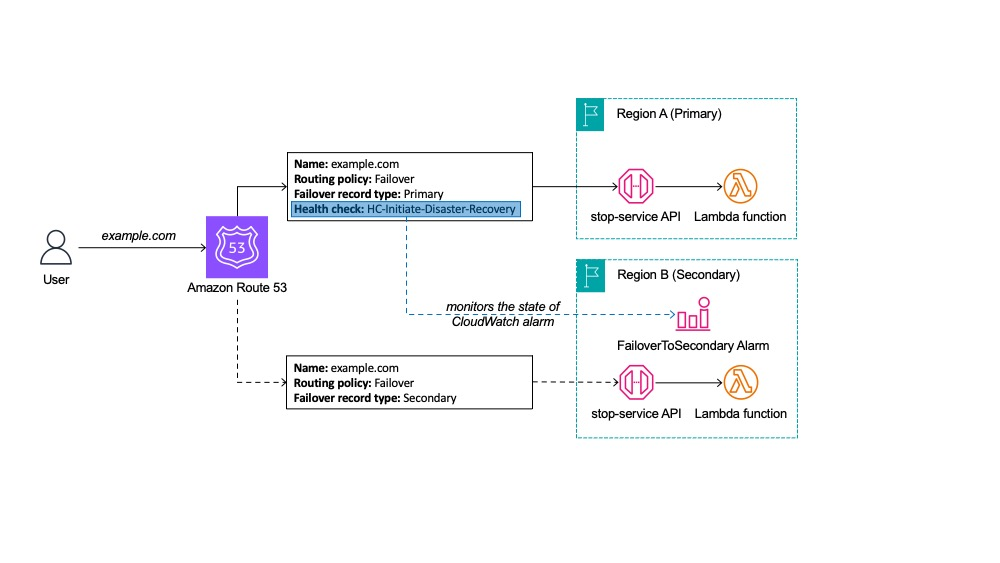
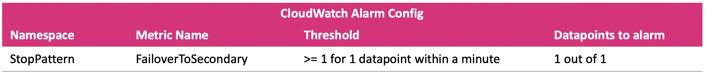
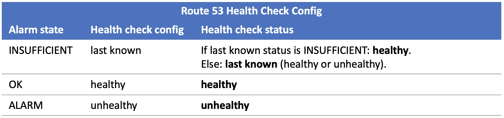

# Multi-Region Failover Pattern: Sandby Takes Over Primary (STOP)
In a disaster recovery (DR) scenario, a simple and effective approach is required to mitigate failures and subsequently resume normal operations. For this process to be efficient and reliable, it must be straightforward, involve minimal steps, and be practiced regularly. Many companies leverage DNS record updates for failover purposes. This demo describes the utilization of DNS updates for effective DR and highlights the principles and best practices that should be adopted when following this approach.

This demonstration showcases a pattern referred to as "standby takes over primary" (STOP). This strategy relies on a healthy standby region and application. With this solution, a resource in the standby region is utilized to control the failover process. This enables the initiation of a failover without depending on any resources in the primary region or Route 53 control plane operations for changing DNS records.

At a minimum, this solution uses one health check, which checks the status of a resource in the standby Region. Let’s examine an example of this architecture.



We start with a Route 53 health check, HC-Initiate-Disaster-Recovery, that is associated with the Route 53 DNS record for our application in the primary Region (Region A). This health check looks for a condition that enables an operator (or automation) to declare the primary region “unhealthy” and initiates failover. The condition is straightforward; in our case, we use a CloudWatch Alarm on the secondary region that monitors the StopPatten/FailoverToSecondary metric.

Here is the alarm configuration:



The HC-Initiate-Disaster-Recovery health check is configured as follows:



For more details, please refer to our AWS blog post (WIP).

## How it works

This stack will deploy an Amazon API Gateway Rest Regional API with a Lambda integration. The AWS Lambda function is written in Python3.9. The function returns a small message with the service name and the Region it is deployed at. The inline code of the lambda is written in the template itself.

That API will be deployed both on the primary and secondary regions. If an issue with the primary region occurs, you can publish a specific CloudWatch metric into the secondary region, changing the Route 53 health check status, then shifting traffic to the secondary region. 

This example demonstrates the failover only and does not encompass authentication and data for the multiple regions.


## Deployment instructions

Before deploying this application you will need the following:
* A public domain (example.com) registered with Amazon Route 53. More details [here](https://docs.aws.amazon.com/Route53/latest/DeveloperGuide/registrar.html)
* An AWS Certificate Manager (ACM) certificate (*.example.com) for your domain name **on both primary and secondary regions** you plan to deploy your APIs on. More details [here](https://docs.aws.amazon.com/acm/latest/userguide/gs.html)

Then follow the steps below, in this exact order. It is important to deploy our demo on the secondary region first and then deploy it on the primary region. The reason for that is because the primary region will deploy a Route53 heathcheck that requires a CloudWatch alarm on the secondary region.

1. Create a new directory, navigate to that directory in a terminal and clone the GitHub repository:
    ``` 
    git clone https://github.com/aws-samples/multi-region-failover-pattern-standby-takes-over-primary.git
    
    ```
2. Change directory to the project you just cloned:
    ``` 
    cd multi-region-failover-pattern-standby-takes-over-primary
    
    ```
3. From the command line, use AWS SAM to deploy the AWS resources for the stack as specified in the template.yml file on the secondary Region:
    ```
    sam deploy --guided --config-env secondary
    ```
4. During the prompts:
    * **Stack Name:** Enter a stack name. You can just hit enter if you want to accept the default value.
    * **AWS Region:** Enter the desired secondary AWS Region. This stack has been tested with both us-east-1 and us-west-2.
    * **AlarmRegion:** Just hit enter to skip, as this parameter is only needed on the primay region.
    * **AlarmName:** Just hit enter to skip, as this parameter is only needed on the primay region.
    * **PublicHostedZoneId:** You must have a public hosted zone in Route 53 with your domain name (i.e. example.com). Enter the Hosted Zone Id for this hosted zone.
    * **DomainName:** Enter your custom domain name (i.e. example.com).
    * **CertificateArn** You must have an ACM certificate that covers your custom domain namespace (i.e. *.example.com) on the Region your are deploying this stack. Enter the ARN for this certificate here. **Make sure you are getting the certificate arn for the right Region**.
    * **Stage:** Enter the name of the stage within your API Gateway that you would like to map to your custom domain name.
    * **FailoverType:** Accept the defaults and use **SECONDARY** here.
    * Allow SAM CLI to create IAM roles with the required permissions.
    * Allow SAM CLI to create the StopLambdaRegionalApi Lambda function.
    * **SAM configuration environment** Accept the **secondary** default value.

    Note the outputs from the SAM deployment process. These contain details which are used for testing.

    Once you have run `sam deploy --guided --config-env secondary` mode once and saved arguments to a configuration file (samconfig.toml), you can use `sam deploy --config-env secondary` in future to use these defaults.

5.  From the command line, use AWS SAM to deploy the AWS resources for the stack as specified in the template.yml file on the primary Region:
    ```
    sam deploy --guided --config-env primary
    ```
6. During the prompts:
    * **Stack Name:** Enter a stack name. You can just hit enter if you want to accept the default value.
    * **AWS Region:** Enter the desired primary AWS Region. This stack has been tested with both us-east-1 and us-west-2.
    * **AlarmRegion:** Choose the region you deployed the secondary stack on. For example, us-west-2.
    * **AlarmName:** Choose the exact value for the **AlarmName** key on the Outputs of your deployment on the secondary region (step 3 above).
    * **PublicHostedZoneId:** You must have a public hosted zone in Route 53 with your domain name (i.e. example.com). Enter the Hosted Zone Id for this hosted zone.
    * **DomainName:** Enter your custom domain name (i.e. example.com).
    * **CertificateArn** You must have an ACM certificate that covers your custom domain namespace (i.e. *.example.com) on the Region your are deploying this stack. Enter the ARN for this certificate here. **Make sure you are getting the certificate arn for the right Region**.
    * **Stage:** Enter the name of the stage within your API Gateway that you would like to map to your custom domain name.
    * **FailoverType:** Accept the defaults and use **PRIMARY** here.
    * Allow SAM CLI to create IAM roles with the required permissions.
    * Allow SAM CLI to create the StopLambdaRegionalApi Lambda function.
    * **SAM configuration environment** Accept the **primary** default value.

    Note the outputs from the SAM deployment process. These contain details which are used for testing.

    Once you have run `sam deploy --guided --config-env primary` mode once and saved arguments to a configuration file (samconfig.toml), you can use `sam deploy --config-env primary` in future to use these defaults.

## Testing

Once the stack is deployed on each region, get the API endpoint from the EndpointUrl output parameter.
Paste the URL in a browser, or in Postman, or using the curl command.
Eg: 
```bash
curl https://aabbccddee.execute-api.us-east-1.amazonaws.com/prod
```

You should see a response similar to:
```json
{"service": "stop-demo", "region": "your-selected-Region"}
```

You can do the same for both stacks on the primary and secondary regions.

Now test that your regional service is accessible via your Route53 domain.
You can get that URL from the **CustomDomainNameEndpoint** output parameter.
Eg: 
```bash
curl https://example.com
```

You should see a response similar to:
```json
{"service": "stop-demo", "region": "your-primary-Region"}
```

## Cleanup
 
1. Delete the stack on the primary Region.
    ```bash
    sam delete --config-env primary
    ```
1. Delete the stack on the secondary Region.
    ```bash
    sam delete --config-env secondary
    ```
----
Copyright 2023 Amazon.com, Inc. or its affiliates. All Rights Reserved.

SPDX-License-Identifier: MIT-0