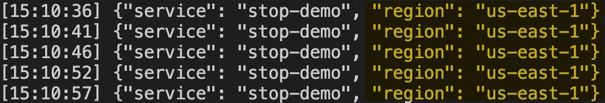
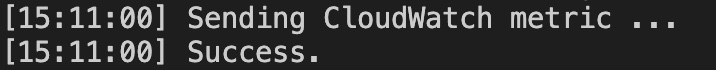
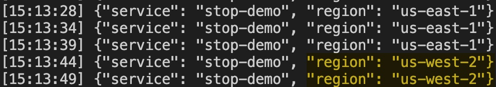
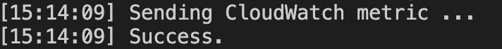
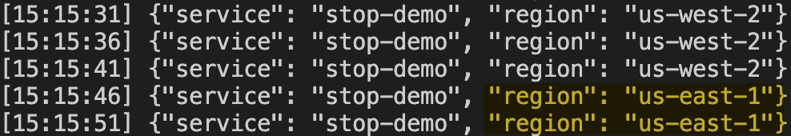

# Multi-Region Failover Pattern: Standby Takes Over Primary (STOP)
In a disaster recovery (DR) scenario, a simple and effective approach is required to mitigate failures and subsequently resume normal operations. For this process to be efficient and reliable, it must be straightforward, involve minimal steps, and be practiced regularly. This repo showcases a pattern referred to as "standby takes over primary" (STOP) which relies on a healthy standby Region and application. 

This demo implements the STOP pattern utilizing an Amazon Route 53 health check pointing to an Amazon CloudWatch metric alarm, whose alarm state can be modified to trigger a failover or failback of the application. With this solution, a resource in the standby Region is utilized to control the failover process. This enables the initiation of a failover without depending on any resources in the primary Region or on Route 53 control plane operations for changing DNS records.

At a minimum, this solution uses one health check, which checks the status of a resource in the standby Region. Let’s examine an example of this architecture.


We start with a Route 53 health check named "HC-Initiate-Disaster-Recovery" that is associated with the Route 53 DNS record for our application. This health check looks monitors the state of a CloudWatch metric alarm, a configurable expression that enables an operator (or automated process) to declare the primary Region “unhealthy” and initiate failover from the secondary Region. In this sample, we use a CloudWatch Alarm on the secondary Region that monitors the StopPatten/FailoverToSecondary metric. If the metric value is >= "1.0" the alarm will trigger, if the value is "0.0" the alarm state will be "OK". Here is the alarm configuration:


The Route 53 health check condition is straightforward, if the alarm is in an "ALARM" state, mark the health check "unhealthy". If the alarm is in an "OK" state, mark the health check "healthy". The HC-Initiate-Disaster-Recovery health check is configured as follows:


For more details, please refer to our AWS blog post (WIP).

## How it works

This stack will deploy an Amazon API Gateway REST Regional API with an AWS Lambda integration. The Lambda function is written in Python3.9 and  returns a message with the service name and the Region it is deployed in. The inline code of the Lambda is written in the template.

That API will be deployed both on the primary and secondary Regions. If an issue with the primary Region occurs, you can publish a specific CloudWatch metric into the secondary Region, changing the Route 53 health check status, and shifting traffic to the secondary Region. When your primary Region is healthy again, you update the value of the CloudWatch metric in the secondary Region, making the Route 53 health check "healthy" and routing traffic back to the primary Region. 

This example demonstrates the failover and failback process only and does not encompass authentication and data for the Regions.

## Deployment instructions

### Pre-requisites
Before deploying this application you will need the following:
* A public domain (example.com) registered with Amazon Route 53. More details [here](https://docs.aws.amazon.com/Route53/latest/DeveloperGuide/registrar.html)
* An AWS Certificate Manager (ACM) certificate (*.example.com) for your domain name **on both primary and secondary Regions** you plan to deploy your APIs on. More details [here](https://docs.aws.amazon.com/acm/latest/userguide/gs.html)

### Deploy the application to the secondary Region
>Note: It is important to deploy our demo on the secondary Region first and then deploy it on the primary Region. The reason for this is because the primary Region will deploy a Route53 heathcheck that requires a CloudWatch alarm on the secondary Region and the deployment will fail if this alarm is not already deployed.

1. Create a new directory, navigate to that directory in a terminal and clone the GitHub repository:
    ``` 
    git clone https://github.com/aws-samples/multi-Region-failover-pattern-standby-takes-over-primary.git
    
    ```
2. Change directory to the project you just cloned:
    ``` 
    cd multi-Region-failover-pattern-standby-takes-over-primary
    
    ```
3. From the command line, use AWS SAM to deploy the AWS resources for the stack as specified in the template.yml file on the secondary Region:
    ```
    sam deploy --guided --config-env secondary
    ```
4. During the prompts:
    * **Stack Name:** Enter a stack name. You can just hit enter if you want to accept the default value.
    * **AWS Region:** Enter the desired secondary AWS Region. This stack has been tested with both us-east-1 and us-west-2.
    * **AlarmRegion:** Just hit enter to skip, as this parameter is only needed on the primay Region.
    * **AlarmName:** Just hit enter to skip, as this parameter is only needed on the primay Region.
    * **PublicHostedZoneId:** You must have a public hosted zone in Route 53 with your domain name (i.e. example.com). Enter the Hosted Zone Id for this hosted zone.
    * **DomainName:** Enter your custom domain name (i.e. example.com).
    * **CertificateArn** You must have an ACM certificate that covers your custom domain namespace (i.e. *.example.com) on the Region your are deploying this stack. Enter the ARN for this certificate here. **Make sure you are getting the certificate arn for the right Region**.
    * **Stage:** Enter the name of the stage within your API Gateway that you would like to map to your custom domain name.
    * **FailoverType:** Accept the defaults and use **SECONDARY** here.
    * Allow SAM CLI to create IAM roles with the required permissions.
    * Allow SAM CLI to create the StopLambdaRegionalApi Lambda function.
    * **SAM configuration environment** Accept the **secondary** default value.

    Note the outputs from the SAM deployment process. These contain details which are used for testing.

    Once you have run `sam deploy --guided --config-env secondary` mode once and saved arguments to a configuration file (samconfig.toml), you can use `sam deploy --config-env secondary` in future to use these defaults.

### Deploy the application to the primary Region

1.  From the command line, use AWS SAM to deploy the AWS resources for the stack as specified in the template.yml file on the primary Region:
    ```
    sam deploy --guided --config-env primary
    ```
2. During the prompts:
    * **Stack Name:** Enter a stack name. You can just hit enter if you want to accept the default value.
    * **AWS Region:** Enter the desired primary AWS Region. This stack has been tested with both us-east-1 and us-west-2.
    * **AlarmRegion:** Choose the Region you deployed the secondary stack on. For example, us-west-2.
    * **AlarmName:** Choose the exact value for the **AlarmName** key on the Outputs of your deployment on the secondary Region (step 3 above).
    * **PublicHostedZoneId:** You must have a public hosted zone in Route 53 with your domain name (i.e. example.com). Enter the Hosted Zone Id for this hosted zone.
    * **DomainName:** Enter your custom domain name (i.e. example.com).
    * **CertificateArn** You must have an ACM certificate that covers your custom domain namespace (i.e. *.example.com) on the Region your are deploying this stack. Enter the ARN for this certificate here. **Make sure you are getting the certificate arn for the right Region**.
    * **Stage:** Enter the name of the stage within your API Gateway that you would like to map to your custom domain name.
    * **FailoverType:** Accept the defaults and use **PRIMARY** here.
    * Allow SAM CLI to create IAM roles with the required permissions.
    * Allow SAM CLI to create the StopLambdaRegionalApi Lambda function.
    * **SAM configuration environment** Accept the **primary** default value.

    Note the outputs from the SAM deployment process. These contain details which are used for testing.

    Once you have run `sam deploy --guided --config-env primary` mode once and saved arguments to a configuration file (samconfig.toml), you can use `sam deploy --config-env primary` in future to use these defaults.

## Testing

After deploying the application on both primary and secondary Regions, traffic will initially be routed to the primary Region only. You will then use our test scripts to send continuous traffic to the demo api and trigger failover and failback.

Edit the `bin/test.sh` file on line 3 to point to your domain name (example.com). Then give that file execution permissions and run it:
```
chmod +x bin/*.sh
./bin/test.sh
```

This script will send an HTTP request to your endpoint every 5 seconds. Initially all requests will be sent to the primary Region (us-east-1 in this example):



Open a new terminal window, make sure to go to the root folder where you downloaded this project to (multi-Region-failover-pattern-standby-takes-over-primary) and run this script to monitor the CloudWatch alarm state:

```
./bin/monitor-cloudwatch-alarm.sh
```

The command output should be similar to the one below:


Open a new terminal window, make sure to go to the root folder where you downloaded this project to (multi-Region-failover-pattern-standby-takes-over-primary) and trigger the failover:

```
./bin/failover-to-secondary.sh
```

The command output should be similar to the one below:



After a few minutes, you should see the alarm state change to ALARM:


After a few minutes, you should see the traffic being routed to your secondary Region:



Open a new terminal window, make sure to go to the root folder where you downloaded this project to (multi-Region-failover-pattern-standby-takes-over-primary) and trigger the failback:

```
./bin/failback-to-primary.sh
```

The command output should be similar to the one below:



After a few minutes, you should see the alarm state change to OK:


After a few minutes, you should see the traffic being routed back to your primary Region:



## Cleanup
 
1. Delete the stack on the primary Region.
    ```bash
    sam delete --config-env primary
    ```
1. Delete the stack on the secondary Region.
    ```bash
    sam delete --config-env secondary
    ```
----
Copyright 2023 Amazon.com, Inc. or its affiliates. All Rights Reserved.

SPDX-License-Identifier: MIT-0
